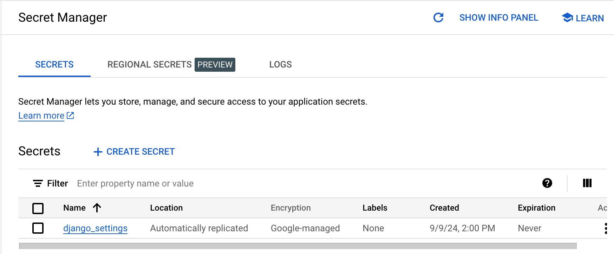

## Setup

App Engine is Google Cloud's original serverless runtime, developers upload their apps to App Engine, and Google Cloud takes care of the rest.

1. Go to your [google cloud console](https://console.cloud.google.com/projectselector2/home/dashboard?_ga=2.2137520.1099778687.1726449732-224993696.1657402990) project selector page, select or create a Google Cloud project.
2. [Make sure the billing is enabled for you project](https://cloud.google.com/billing/docs/how-to/verify-billing-enabled#confirm_billing_is_enabled_on_a_project)
3. [Install](https://cloud.google.com/sdk/docs/install) the Google Cloud cli
4. Use your Google Cloud user credentials to authenticate with the Google Cloud CLI `gcloud auth login`
5. Run [gcloud init](https://cloud.google.com/sdk/docs/initializing) under your project, to initialize the Google Cloud SDK and set up your environment for interacting with Google Cloud services. It gonna authenticates your cloud account, and configures a project (use an existing one or create a new one), set zone etc.
   You can use this command to show all the data about the current application,
    ```bash
    gcloud app describe 
    ```
6. **Enable Google App Engine Admin API, Secret Manager, and Cloud Build APIs, Cloud Storage.**
   1. Go to console, on the search Bar, search “App Engine”, Click **Enable**. If there is no prompt to enable the API, then it is already enabled and no action is needed. Also enable Secret manager, and Cloud build.

   2. Only a single App Engine application resource can be created per Google Cloud project and the specified region cannot be changed after those resources are created.

   3. Then go to your [app engine page](https://console.cloud.google.com/projectselector/appengine/create?st=true&_ga=2.48807590.1099778687.1726449732-224993696.1657402990). 

   4. In the **Create App** page, select a region, service account, and enable billing:

      - select a region to specify where you want to your App Engine application located.
      - Select a [service account](https://cloud.google.com/appengine/docs/flexible/configure-service-accounts) for your app from **Identity and API access**.
7. After Your App Engine application has been created, a default service account **project-id@appspot.gserviceaccount.com** are created automatically, you can see all your service accounts from [here](https://console.cloud.google.com/iam-admin/serviceaccounts?_ga=2.15340982.1099778687.1726449732-224993696.1657402990) , and also can see roles of all accounts from [IAM](https://console.cloud.google.com/iam-admin/) page.

   Basically, there are two default roles for this service account, we may need to change service account permissions later when you find your deployment fails.

    - **App Engine Admin (roles/appengine.admin)**: This role grants permission to manage applications, services, and versions within App Engine.
    - **Storage Object Viewer (roles/storage.objectViewer)**: This role allows the account to read data from Cloud Storage buckets. This is often needed for storing application dependencies or assets.

   You can use this command on your machine to check all your roles as well:

    ```bash
    gcloud projects get-iam-policy [project-id]
    ```
8. Store Secret Values in Secret manager
    1. Now we have django key which cannot stored in our repo, we're gonna use **Secret Manager to store secret values.**
    2. [Go to secret manager page](https://console.cloud.google.com/security/secret-manager?project=_&_ga=2.211988756.1099778687.1726449732-224993696.1657402990), Click **Create secret,**  In the **Name** field, enter `django_settings` , In the **Secret value** dialog, input this, and then Click **Create secret**.
        ```bash
        SECRET_KEY="YOUR SECRET KEY"
        GOOGLE_API_KEY="YOUR OTHER KEY"
        DEBUG=FALSE
        ```

       Confirm that the `DEBUG` variable in `mysite/settings.py` is set to `False` to prevent detailed error pages from being displayed to the user, which can [leak information about the configurations](https://docs.djangoproject.com/en/stable/howto/error-reporting/#error-reporting).

    3. Delete the local file to prevent [local setting overrides](https://cloud.google.com/python/django/appengine#local-secret-overrides)
    4. Configure access to the secret:
        1. Click on the **Permissions** tab. Click **Add**.
        2. In the **New Members** field, enter **PROJECT_ID@appspot.gserviceaccount.com,** and then press `Enter`.In the **Role** drop-down menu, select **Secret Manager Secret Accessor**. Click **Save**.

           

    5.  In our settings.py, we write logic to use the **Secret Manager Python API** to retrieve the latest version of the named secret, and pull it into the environment.

        If a `.env` file is found on the local filesystem, it is used instead of the value from Secret Manager. Creating a `.env` file locally can help with local testing

        ```python
        import environ
        from google.cloud import secretmanager
        
        # Build paths inside the project like this: os.path.join(BASE_DIR, ...)
        BASE_DIR = os.path.dirname(os.path.dirname(os.path.abspath(__file__)))
        
        env = environ.Env(DEBUG=(bool, False))
        env_file = os.path.join(BASE_DIR, ".env")
        
        if os.path.isfile(env_file):
            # Use a local secret file, if provided
            env.read_env(env_file)
        elif os.environ.get("GOOGLE_CLOUD_PROJECT", None):
            # Pull secrets from Secret Manager
            project_id = os.environ.get("GOOGLE_CLOUD_PROJECT")
        
            client = secretmanager.SecretManagerServiceClient()
            settings_name = os.environ.get("SETTINGS_NAME", "django_settings")
            name = f"projects/{project_id}/secrets/{settings_name}/versions/latest"
            payload = client.access_secret_version(name=name).payload.data.decode("UTF-8")
        
            env.read_env(io.StringIO(payload))
        else:
            raise Exception("No local .env or GOOGLE_CLOUD_PROJECT detected. No secrets found.")
        
        SECRET_KEY = env("SECRET_KEY")
        GOOGLE_API_KEY = env("GOOGLE_API_KEY")
        ```
9. Before deploy, we need make sure our app is running on local machine.

   In the original terminal, set the Project ID locally. I’ve already added this environment variable to package.json, so just run `npm run dev`

    ```bash
      "scripts": {
        "venv": "source ./venv/Scripts/activate",
        "dev": "GOOGLE_CLOUD_PROJECT=[YOUR_PROJECT_ID] python3 ./manage.py runserver",
        "deploy": "gcloud app deploy app.yaml --project=[YOUR_PROJECT_ID]"
      },
    ```

### Deploy your app

1. To deploy your web service to App Engine, you need an `app.yaml` file. This configuration file defines your web service's settings for App Engine.  Create your`app.yaml`file in the root directory of your project. For more complicated web services, you can configure additional settings in your `app.yaml` , see the [app.yaml reference](https://cloud.google.com/appengine/docs/standard/reference/app-yaml).
2. Run the following command from within the root directory of your application where the app.yaml file is located: [https://cloud.google.com/sdk/gcloud/reference/app/deploy](https://cloud.google.com/sdk/gcloud/reference/app/deploy).
   Confirm the settings by typing "yes" when prompted.
    ```bash
    gcloud app deploy
    ```

The App Engine application will then be created. Each time that you deploy your web service, a new [version](https://cloud.google.com/appengine/docs/an-overview-of-app-engine) of that app is created in App Engine.

During deployment, a container image is created using the [Cloud Build](https://cloud.google.com/container-builder/docs) service, and then a copy is uploaded to Google Cloud Storage before it is run in App Engine.

To launch your browser enter the following command, then click on the link it provides:

```bash
gcloud app browse
```

Use the [Google Cloud console](https://console.cloud.google.com/appengine/services?_ga=2.14785974.1099778687.1726449732-224993696.1657402990) to manage and view the services and versions that you deploy to App Engine:
To learn how to send requests to specific services and versions, see [Splitting Traffic](https://cloud.google.com/appengine/docs/standard/splitting-traffic).
